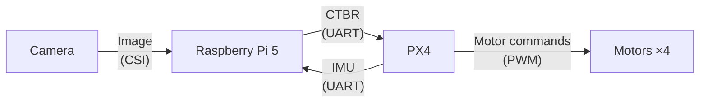
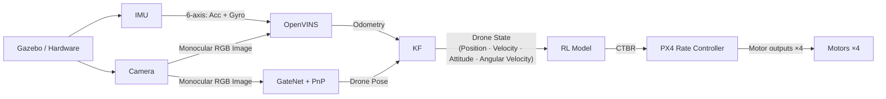

```mermaid
flowchart LR
    C["Camera"]
    R["Raspberry Pi 5"]
    P["PX4"]
    M["Motors ×4"]

    C -->|"Image<br/>(CSI)"| R
    R -->|"CTBR<br/>(UART)"| P
    P -->|"IMU<br/>(UART)"| R
    P -->|"Motor commands<br/>(PWM)"| M
```

```mermaid
flowchart LR
    A["Gazebo / Hardware"]
    I["IMU"]
    C["Camera"]
    O["OpenVINS"]
    G["GateNet + PnP"]
    K["KF"]
    R["RL Model"]
    P["PX4 Rate Controller"]
    M["Motors ×4"]

    A --> I
    A --> C

    I -->|"6-axis: Acc + Gyro"| O
    C -->|"Monocular RGB Image"| O
    C -->|"Monocular RGB Image"| G

    O -->|"Odometry"| K
    G -->|"Drone Pose"| K

    K -->|"Drone State<br/>(Position · Velocity · Attitude · Angular Velocity)"| R
    R -->|"CTBR"| P
    P -->|"Motor outputs ×4"| M
```
