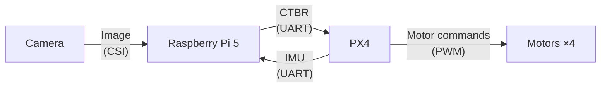
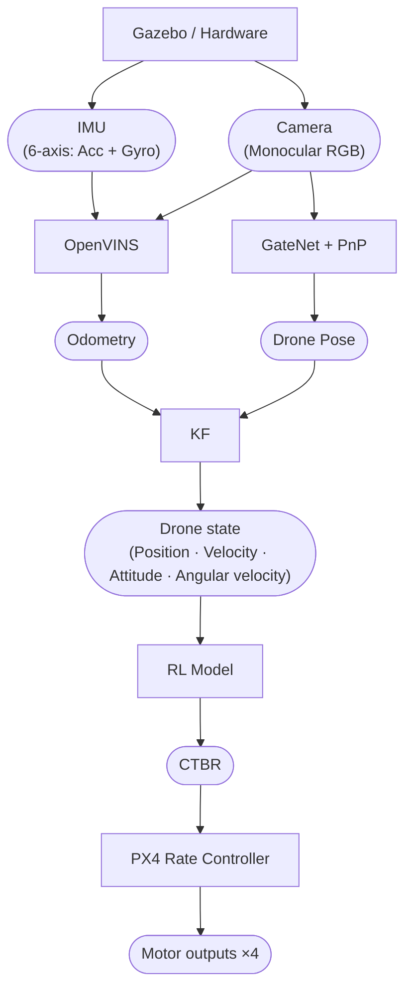

```mermaid
flowchart LR
    C["Camera"]
    R["Raspberry Pi 5"]
    P["PX4"]
    M["Motors ×4"]

    C -->|"Image<br/>(CSI)"| R
    R -->|"CTBR<br/>(UART)"| P
    P -->|"IMU<br/>(UART)"| R
    P -->|"Motor commands<br/>(PWM)"| M
```

```mermaid
flowchart TB
    A["Gazebo / Hardware"]
    A --> I(["IMU<br/>(6-axis: Acc + Gyro)"])
    A --> C(["Camera<br/>(Monocular RGB)"])

    I --> O["OpenVINS"]
    C --> O
    C --> G["GateNet + PnP"]

    O --> OD(["Odometry"])
    G --> GP(["Drone Pose"])

    OD --> K["KF"]
    GP --> K

    K --> S(["Drone state<br/>(Position · Velocity · Attitude · Angular velocity)"])
    S --> R["RL Model"]
    R --> T(["CTBR"])
    T --> P["PX4 Rate Controller"]
    P --> M(["Motor outputs ×4"])
```
