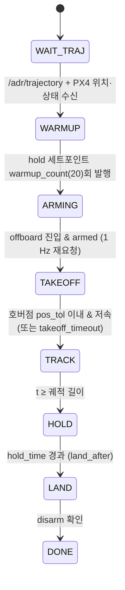

# Step 1 기술 문서 — min-snap + PX4 Position Control

## 목차

1. [목적과 범위](#1-목적과-범위)
2. [노드 및 토픽 구조](#2-노드-및-토픽-구조)
3. [좌표계와 규약](#3-좌표계와-규약)
4. [코스 정의 (gates.yaml)](#4-코스-정의-gatesyaml)
5. [min-snap 궤적 생성](#5-min-snap-궤적-생성)
6. [PX4 offboard 제어](#6-px4-offboard-제어)
7. [시뮬 자산: 드론 모델·게이트·월드·airframe](#7-시뮬-자산-드론-모델게이트월드airframe)
8. [환경 설치 (Ubuntu VM)](#8-환경-설치-ubuntu-vm)
9. [실행 절차](#9-실행-절차)
10. [실기체(mocap) 전환](#10-실기체mocap-전환)
11. [검증 체크리스트](#11-검증-체크리스트)
12. [트러블슈팅](#12-트러블슈팅)
13. [다음 단계(step 2/3)와의 접점](#13-다음-단계step-23와의-접점)

---

## 1. 목적과 범위

step 1 은 인식 없이 **알려진 게이트 맵**으로 한 바퀴를 도는 것까지다. 목적은 파이프라인 뼈대(토픽·프레임·launch·시뮬 자산)를 세워 이후 단계에서 **노드만 교체**할 수 있게 하는 것.

| 요소 | step 1 구현 | 비고 |
|---|---|---|
| 게이트 인식 | `adr_perception/gate_detector` — 주황 HSV 임계 + 컨투어로 bbox·개구부 중심(2D) 검출. 제어에는 아직 안 씀 | step 3 Gatenet + PnP 가 3D `GateArray` 로 확장 |
| 위치 추정 | sim: PX4 EKF2(GPS 시뮬) 또는 진실값 주입 / 실기체: mocap → `vehicle_visual_odometry` | 실기체 파라미터 세트 = airframe 4031 |
| 경로 계획 | `adr_planning` min-snap (7차 piecewise polynomial) | 게이트 중심 + 전후 접근점을 웨이포인트로 |
| 제어 | `adr_control/px4_position_controller` → `TrajectorySetpoint`(pos+vel+acc feedforward) | step 2 RL 노드가 `OffboardBase` 를 상속해 rate setpoint 로 교체 |

## 2. 노드 및 토픽 구조

### 2.1 노드 그래프

```mermaid
graph TD
    GZ["Gazebo Harmonic<br/>(adr_cross.sdf, SITL)"]
    MOCAP["Qualisys<br/>(motion_capture_tracking) 실기체"]
    USBCAM["/dev/video0<br/>(v4l2_camera) 실기체"]

    subgraph adr_sim ["adr_sim (SITL 전용)"]
        SIMLAUNCH["sim.launch.py<br/>gz + Agent + PX4 SITL + bridge 기동"]
        GZBRIDGE["ros_gz_bridge"]
    end

    subgraph adr_video ["adr_video"]
        RELAY["camera_relay 실기체"]
    end

    IMAGE(["/adr/camera/image_raw"])

    subgraph adr_perception ["adr_perception"]
        DET["gate_detector<br/>(HSV 주황 → bbox·개구부 중심)"]
    end

    DETECTED(["/adr/gate_detections"])
    DEBUG(["/adr/perception/debug_image<br/>(구독자 있을 때만)"])
    GATES_YAML[("gates.yaml")]

    subgraph adr_planning ["adr_planning"]
        PLAN["gate_planner<br/>(min-snap)"]
    end

    TRAJ(["/adr/trajectory"])

    subgraph adr_control ["adr_control"]
        CTRL["px4_position_controller<br/>(상태머신 + TrajectorySetpoint)"]
    end

    subgraph adr_bringup ["adr_bringup"]
        MB["mocap_bridge 실기체"]
        O2TF["px4_odom_to_tf"]
        MARK["gate_markers"]
    end

    FMU_IN(["/fmu/in/*<br/>offboard_control_mode · trajectory_setpoint · vehicle_command"])
    FMU_OUT(["/fmu/out/*<br/>vehicle_local_position · vehicle_status · vehicle_odometry"])
    EV(["/fmu/in/vehicle_visual_odometry"])
    AGENT["MicroXRCEAgent"]
    PX4["PX4<br/>(SITL / 실기체 FC)"]
    RVIZ["rviz2"]

    GZ -->|gz topic| GZBRIDGE --> IMAGE
    USBCAM --> RELAY --> IMAGE
    IMAGE --> DET --> DETECTED
    DET -.-> DEBUG
    GATES_YAML --> PLAN --> TRAJ --> CTRL
    GATES_YAML --> MARK
    CTRL --> FMU_IN --> AGENT
    AGENT --> FMU_OUT --> CTRL
    FMU_OUT --> O2TF -.->|TF map→base_link| MARK
    O2TF --> RVIZ
    MARK --> RVIZ
    PLAN -->|/adr/planned_path| RVIZ
    MOCAP -->|/poses| MB --> EV --> AGENT
    GZ -.->|"OdometryPublisher 진실값<br/>ev:=true 일 때 EKF2 가 사용"| PX4
    AGENT <-->|uXRCE-DDS| PX4
    PX4 <-->|센서 / 모터 명령| GZ
```



step 1 에서 실제로 동작하는 경로는 **gates.yaml → gate_planner → px4_position_controller → PX4** 한 줄이다.
카메라·인식 경로는 돌아가지만 아직 제어에 쓰이지 않고(step 3 에서 PnP → 위치 추정에 결합), mocap 경로는 실기체 전용이다(sim 에서는 gz `OdometryPublisher` 가 같은 역할).

### 2.2 노드별 pub/sub

| 노드 | subscribe | publish |
|---|---|---|
| `gate_planner` | — (gates.yaml 파일) | `/adr/trajectory` (latched)<br/>`/adr/planned_path` |
| `px4_position_controller` | `/adr/trajectory`<br/>`/fmu/out/vehicle_local_position`<br/>`/fmu/out/vehicle_status` | `/fmu/in/offboard_control_mode` (50 Hz)<br/>`/fmu/in/trajectory_setpoint` (50 Hz)<br/>`/fmu/in/vehicle_command`<br/>`/adr/controller_state` |
| `px4_odom_to_tf` | `/fmu/out/vehicle_odometry` | TF `map→base_link`<br/>`/adr/odom` |
| `gate_markers` | TF `map→base_link` | `/adr/gate_markers`, `/adr/gates` (latched)<br/>`/adr/flown_path` |
| `mocap_bridge` (실기체) | `/poses` 또는 TF `mocap→adr_racer` | `/fmu/in/vehicle_visual_odometry` |
| `ros_gz_bridge` (SITL) | gz `/adr_racer/camera`, `/clock`, `/model/adr_racer/odometry` | `/adr/camera/image_raw`, `/clock`, `/adr/ground_truth/odom` |
| `camera_relay` (실기체) | `/image_raw` (v4l2_camera) | `/adr/camera/image_raw` |
| `gate_detector` | `/adr/camera/image_raw` | `/adr/gate_detections` (2D bbox·중심, 면적순)<br/>(구독 있을 때만) `/adr/perception/debug_image` |

`/fmu/out/*` 는 **best effort + volatile** 로 구독해야 한다(reliable 로 구독하면 아무것도 안 온다). 버전 관리되는 메시지는 토픽에 `_v<N>` 이 붙으며(예: `vehicle_status_v4`) `offboard_base.px4_topic()` 이 `MESSAGE_VERSION` 상수로 자동으로 맞춘다.

### 2.3 노드별 역할

| 노드 | 패키지 | 역할 | 실행 환경 |
|---|---|---|---|
| `sim.launch.py` | `adr_sim` | gz 월드 + MicroXRCEAgent + PX4 SITL(airframe 주입, daemon) + ros_gz_bridge + 시각화를 한 번에 기동 | SITL |
| `gate_planner` | `adr_planning` | `gates.yaml` 의 게이트 중심·전후 접근점을 웨이포인트로 min-snap 궤적을 한 번 풀어 latched 발행 | 공통 |
| `px4_position_controller` | `adr_control` | 상태머신(warmup→arm→offboard→이륙→궤적 추종→hold→착륙). ENU 궤적을 NED `TrajectorySetpoint` 로 50 Hz 발행. step 2 RL 노드가 같은 `OffboardBase` 를 상속해 교체 | 공통 |
| `px4_odom_to_tf` | `adr_bringup` | PX4 odometry(NED/FRD) → TF `map→base_link`(ENU/FLU) | 공통 |
| `gate_markers` | `adr_bringup` | 게이트 프레임(CUBE)·법선·id 마커, 맵 기반 `GateArray`, TF 누적 비행 경로 | 공통 |
| `mocap_bridge` | `adr_bringup` | mocap 포즈(ENU) → `VehicleOdometry`(NED) 로 PX4 EKF2 에 주입 | 실기체 |
| `camera_relay` | `adr_video` | 카메라 드라이버 출력을 `/adr/camera/image_raw` 규격으로 통일 | 실기체 |
| `gate_detector` | `adr_perception` | 주황 HSV 임계 → 모폴로지 → `RETR_CCOMP` 컨투어(바깥 프레임 + 안쪽 구멍). 게이트마다 bbox, 개구부 중심(구멍 모멘트), 면적, 간이 신뢰도. 디버그 오버레이는 `rqt_image_view /adr/perception/debug_image` 로 볼 때만 생성. 파라미터 `adr_perception/config/gate_detector.yaml` | 공통 |

## 3. 좌표계와 규약

| | ROS 측 (`map`, 궤적, 게이트, mocap) | PX4 측 (`/fmu/*`) |
|---|---|---|
| 월드 | **ENU** (x 동, y 북, z 위) | **NED** (x 북, y 동, z 아래) |
| 기체 | FLU (x 앞, y 왼, z 위) | FRD (x 앞, y 오른, z 아래) |
| yaw | +x(East) 기준 **CCW** | +x(North) 기준 CW(위에서 봤을 때) |

- 변환은 전부 `adr_control/frames.py` 한 곳에서: `(e,n,u) ↔ (n,e,−u)`, `yaw_ned = π/2 − yaw_enu`, 쿼터니언은 `q_ENU→NED=(0,√½,√½,0)`, `q_FLU→FRD=(0,1,0,0)` (PX4 gz_bridge 와 동일 상수). `test/test_frames.py` 가 왕복·기수방향을 검증한다.
- 모든 노드의 public 인터페이스는 ENU 이고 **PX4 경계(publish/subscribe 콜백)에서만** NED 로 바꾼다.
- 게이트 `yaw_deg` = 통과 방향(개구부 법선)의 방위각, ENU CCW. ⚠️ crazyflie 레포 `gates.yaml` 은 CW 관례였으므로 값을 복사해 오면 안 된다.
- `map` = `gates.yaml` 좌표계 = gz 월드 = mocap 프레임. **PX4 local 원점과의 관계는 `origin_mode` 로 처리**한다.
  - `world`(기본, sim `ev:=true` / 실기체 mocap): EKF2 가 외부 위치를 그대로 쓰므로 PX4 local == map. offset 0.
  - `start`(sim `ev:=false` = GPS 시뮬): PX4 local 원점 = 부팅(스폰) 위치. 기체가 `start` 에 놓여 있다고 보고 컨트롤러가 이륙 전 `offset = start − p_local` 을 한 번 재서 모든 세트포인트를 보정하고, `/adr/local_origin`(latched) 으로 `px4_odom_to_tf` 에도 알린다. 이걸 안 하면 코스 전체가 `−start` 만큼 평행이동한 자리에서 비행한다(초기 증상). GPS 모드는 월드 자기장 편각(14.6°)과 EKF2 lookup 편각(취리히 ~3°) 차이로 yaw 도 어긋날 수 있어 **sim 기본은 `ev:=true`** 로 둔다.

## 4. 코스 정의 (gates.yaml)

[`adr_bringup/config/gates.yaml`](../adr_ws/src/adr_bringup/config/gates.yaml) 이 단일 진실 원천이다.

```
          G2 (0, 4) yaw 180
             ┌─┐
   G3 ─┐     │ │     ┌─ G1 (4, 0) yaw 90
 (-4,0)│     └─┘     │
  yaw  │      ↻ CCW  │
  270  └─   ┌─┐     ─┘
             │ │  ● start (2.83, -2.83)
             └─┘
          G4 (0,-4) yaw 0
```

- 반지름 4 m 원 위에 90° 간격, 게이트 중심 높이 1.5 m, 법선 = 원의 접선(CCW 진행).
- 게이트: 내부 1.5 m, 외부 2.1 m(프레임 폭 0.3 m), 두께 0.1 m, 주황색.
- `start` = 이륙 지점(바닥). G4→G1 사이 원호 위에 두어 이륙 후 첫 진입이 자연스럽다.
- 값을 바꾸면 **`adr_sim/scripts/gen_world.py`** 를 다시 돌려 월드와 게이트 모델(`gate:` 치수)을 갱신하고 커밋한다(planner/markers 는 yaml 을 직접 읽으므로 자동 반영).

## 5. min-snap 궤적 생성

`adr_planning/min_snap.py` (numpy 만 사용, ROS 비의존 → Mac 에서 `pytest` 가능)

- 세그먼트마다 7차 다항식, 비용 = ∫ snap² dt (Mellinger & Kumar 2011).
- 등식 제약: 웨이포인트 통과, 시작/끝 vel·acc·jerk = 0, 세그먼트 경계에서 1~4차 미분 연속.
- 풀이: 세그먼트별 정규화 시간 τ=t/T∈[0,1] 로 조건수를 낮춘 뒤, 제약을 SVD nullspace 로 소거한 무제약 QP 를 폐형식으로 푼다(`solve_1d`). x, y, z, yaw 를 독립으로 4번 푼다. 25 세그먼트 기준 ~70 ms.
- 시간 할당: 세그먼트 길이 / `v_avg`, 출발·정지 세그먼트에 `v_avg/a_max` 추가. 샘플링으로 `v_max`, `a_max` 초과 시 전체 시간을 균일 스케일(최대 5회).
- yaw 는 `np.unwrap` 으로 연속화해 풀고, 컨트롤러가 PX4 로 보낼 때 `[-π, π]` 로 감싼다.
- 웨이포인트(`course.py`): `[start 호버점] + ([게이트−d·n, 게이트 중심, 게이트+d·n] × 4게이트 × laps) + [start 호버점]`. `approach_dist` d=0.8 m 의 전후 접근점이 게이트를 **면에 수직으로** 통과하게 만든다(중심 통과 시 속도·법선 cos > 0.97).
- 오프라인 확인: `python3 -m adr_planning.plot_trajectory --gates adr_ws/src/adr_bringup/config/gates.yaml --laps 2`

기본 파라미터(`planner.yaml`: v_avg 3, v_max 6, a_max 8, laps 2)에서 2바퀴 17.7 s, 최고 3.8 m/s.

메시지 `PolynomialTrajectory` 는 세그먼트별 `duration` 과 축별 계수(오름차순, 실제 시간 τ∈[0,duration] 기준)를 담는다. 컨트롤러는 이를 `Trajectory.from_plain` 으로 복원해 50 Hz 로 샘플링한다.

## 6. PX4 offboard 제어

### `OffboardBase` (`adr_control/offboard_base.py`)

컨트롤러 종류와 무관한 부분: `/fmu/out/vehicle_local_position`, `/fmu/out/vehicle_status` 구독(best-effort), `offboard_control_mode` / `trajectory_setpoint` / `vehicle_command` 발행, `arm()`, `set_offboard_mode()`(DO_SET_MODE 176, param1=1, param2=6), `land()`, ENU 입력 → NED 변환. step 2 의 RL 노드는 이를 상속해 `step()` 만 구현하고 `VehicleRatesSetpoint` 를 발행하면 된다.

### `PositionController` 상태기계



| 상태 | OffboardControlMode | 세트포인트 |
|---|---|---|
| WARMUP / ARMING | position | 현재 위치(바닥) hold, yaw = 궤적 시작 yaw |
| TAKEOFF / HOLD | position | 궤적 시작점 / 끝점 hold |
| TRACK | position + velocity + acceleration | 궤적 샘플 pos/vel/acc/yaw/yawrate (feedforward) |
| LAND | — (NAV_LAND 명령, 세트포인트 중단) | — |

- PX4 는 offboard 진입 전에 세트포인트 스트림(≥2 Hz)이 이미 흐르고 있어야 하므로 WARMUP 에서 현재 위치 hold 를 먼저 보낸다.
- TAKEOFF/HOLD 는 `position` 만, TRACK 은 `position+velocity+acceleration`(feedforward) 을 `OffboardControlMode` 에 켠다. 첫 비행에서 튀면 `controller.yaml` 의 `feedforward: false`, launch 인자 `time_scale:=0.5` 로 낮춘다.
- PX4 파라미터 상 `MPC_XY_VEL_MAX`, `MPC_ACC_HOR` 등이 궤적 속도보다 작으면 추종이 늦어진다(airframe 4030 에서 10 m/s, 8 m/s² 로 완화).

## 7. 시뮬 자산: 드론 모델·게이트·월드·airframe

### 드론 `adr_racer` — 250급 레이싱 쿼드

스펙은 [`adr_sim/config/racer_spec.yaml`](../adr_ws/src/adr_sim/config/racer_spec.yaml) 한 곳에 두고 `scripts/gen_racer_model.py` 가 **`model.sdf` 와 PX4 airframe `4030_gz_adr_racer` 를 함께 생성**한다(로터 위치·최대 회전수처럼 양쪽이 일치해야 하는 값을 한 번에 관리).

| 항목 | 값 | 근거 |
|---|---|---|
| 질량 | 0.75 kg (배터리 포함) | 5" 프리스타일/레이싱 AUW 650~850 g |
| 모터 대각 | 250 mm → 암 반경 0.125 m, 로터 (±0.088, ±0.088) | x-config |
| 관성 | Ixx=Iyy 2.5e-3, Izz 4.5e-3 kg·m² | 강체 근사 |
| 프롭 | 5" (x500 의 13.45" 메시를 `<scale>0.372</scale>` 로 축소) | 메시는 `meshes/` 에 복사(BSD-3) |
| 모터 모델 | `maxRotVelocity 3000 rad/s`, `motorConstant 1.4e-6` → 모터당 12.6 N, TWR ≈ 6.8 | 2306 2400KV @ 4S 부하 시 ~28k rpm |
| 카메라 | 640×480, HFOV 90°, 30 Hz, 30° 상향 틸트, gz 토픽 `adr_racer/camera` | 레이싱 카메라 각도 |
| 외관 | 박스 placeholder | STL 준비되면 `meshes/README.md` 절차로 교체 |

PX4 gz_bridge 규약 때문에 **링크 `base_link`, 센서 이름 `imu_sensor / magnetometer_sensor / air_pressure_sensor / navsat_sensor`, 모터 명령 토픽 `/<model>/command/motor_speed`** 는 x500 과 같아야 한다(`scripts/px4_sensors.sdf.inc` 에서 그대로 삽입).

airframe `4030_gz_adr_racer`: `4001_gz_x500` 기반. `CA_ROTORn_PX/PY = ±0.080`(FRD, frame.stl 모터 마운트 실측), `SIM_GZ_EC_MIN/MAX = 300/3000`(= `maxRotVelocity`), `MPC_THR_HOVER 0.31`(ω_hover=√(mg/4k_f)=1146 rad/s 를 [300,3000] 에 선형 매핑), 레이싱용 `MPC_XY_VEL_MAX 10`, `MPC_ACC_HOR 8`, `MPC_JERK_AUTO 20`, `MPC_TILTMAX_AIR 60`. MC 자세/각속도 게인은 `rc.mc_defaults` 그대로이므로 **첫 호버에서 진동하면 `MC_ROLLRATE_P/PITCHRATE_P` 를 0.1 → 0.05 부터 낮춘다.**

airframe `4031_gz_adr_racer_ev`: 4030 + `EKF2_EV_CTRL 15`, `EKF2_HGT_REF 3`, `EKF2_GPS_CTRL 0`, `EKF2_BARO_CTRL 0`. 외부 위치(sim: OdometryPublisher 진실값, 실기체: mocap)만으로 EKF2 를 돌리는 세트.

### 게이트 `adr_gate`

box 링크 4개(좌·우·상·하)로 된 static 모델. 원점 = 개구부 중심, +x = 통과 방향. 색 `1.0 0.45 0.0`.

### 월드 `adr_cross.sdf`

`gen_world.py` 가 `gates.yaml` 에서 생성. PX4 가 gz 를 직접 띄우지 않는 **standalone 모드**이므로 PX4 `server.config` 가 넣어주던 시스템 플러그인(Physics, UserCommands, SceneBroadcaster, Contact, Imu, AirPressure, Magnetometer, NavSat, Sensors(ogre2))을 월드에 직접 포함하고, navsat 용 `<spherical_coordinates>` 도 넣는다. 게이트 4개와 `adr_racer` 를 `<include>` 로 배치(드론 이름 `adr_racer` = `PX4_GZ_MODEL_NAME`).

## 8. 환경 설치 (Ubuntu VM)

버전 조합: Ubuntu 22.04 + ROS 2 Humble + **Gazebo Harmonic** + PX4 v1.18 (+ px4_msgs 는 PX4 와 같은 버전의 submodule).

```bash
# 1) ROS 2 Humble + Gazebo Harmonic
sudo apt install ros-humble-desktop ros-dev-tools
sudo curl https://packages.osrfoundation.org/gazebo.gpg -o /usr/share/keyrings/pkgs-osrf-archive-keyring.gpg
echo "deb [arch=$(dpkg --print-architecture) signed-by=/usr/share/keyrings/pkgs-osrf-archive-keyring.gpg] http://packages.osrfoundation.org/gazebo/ubuntu-stable $(lsb_release -cs) main" | sudo tee /etc/apt/sources.list.d/gazebo-stable.list
sudo apt update && sudo apt install gz-harmonic

# 2) ros_gz 를 Harmonic 으로 소스 빌드 (apt 의 ros-humble-ros-gz* 는 Fortress 기준이라 사용 불가)
sudo apt install libgz-msgs10-dev libgz-transport13-dev -y
mkdir -p ~/ros_gz_harmonic_ws/src && cd ~/ros_gz_harmonic_ws/src
git clone https://github.com/gazebosim/ros_gz.git -b humble
cd ~/ros_gz_harmonic_ws && source /opt/ros/humble/setup.bash
GZ_VERSION=harmonic colcon build --packages-select ros_gz_interfaces ros_gz_bridge ros_gz_sim ros_gz_image

# 3) PX4-Autopilot (레포 밖, ~/PX4-Autopilot). 빌드만 하면 되고 소스 수정은 없다.
git clone -b release/1.18 --recursive https://github.com/PX4/PX4-Autopilot.git ~/PX4-Autopilot
bash ~/PX4-Autopilot/Tools/setup/ubuntu.sh
cd ~/PX4-Autopilot && make px4_sitl

# 4) Micro-XRCE-DDS-Agent (레포 밖). ROS 가 source 되지 않은 셸에서 빌드해야 fastcdr 버전 충돌이 없다.
git clone -b v2.4.3 https://github.com/eProsima/Micro-XRCE-DDS-Agent.git ~/Micro-XRCE-DDS-Agent
cd ~/Micro-XRCE-DDS-Agent && mkdir build && cd build
env -i HOME=$HOME PATH=/usr/local/bin:/usr/bin:/bin bash -c 'cmake .. && make -j$(nproc) && sudo make install && sudo ldconfig /usr/local/lib/'
#   (대안) sudo snap install micro-xrce-dds-agent --edge  → launch 에 agent:=micro-xrce-dds-agent

# 5) 이 레포 (메시는 git LFS)
sudo apt install git-lfs && git lfs install
git clone --recursive https://github.com/sungho2574/autonomous-drone-racing.git
cd autonomous-drone-racing/adr_ws
source ~/ros_gz_harmonic_ws/install/setup.bash
rosdep install --from-paths src --ignore-src -r -y     # motion_capture_tracking 의존성 포함
colcon build --symlink-install                          # px4_msgs 가 수 분 걸린다. 중단하면 install 이 빠지니 끝까지
source install/setup.bash
```

- PX4 airframe(`adr_sim/assets/px4/airframes/4030_*, 4031_*`)은 **실행할 때마다** `sim.launch.py` 가 `$PX4_DIR/build/px4_sitl_default/etc/init.d-posix/airframes/` 에 복사한다. ROMFS 등록·재빌드가 필요 없고, `make px4_sitl` 로 etc 가 다시 만들어져도 다음 실행에 다시 들어간다.
- px4_msgs 는 PX4 버전과 메시지 정의가 맞아야 한다(어긋나면 빌드는 되지만 `/fmu/out/*` 이 조용히 안 들어온다). 버전 관리되는 메시지는 토픽에 `_v<N>` 이 붙으며 코드가 `MESSAGE_VERSION` 상수에서 자동으로 맞춘다.

## 9. 실행 절차

터미널 2개. 둘 다 `source /opt/ros/humble/setup.bash && source ~/ros_gz_harmonic_ws/install/setup.bash && source ~/autonomous-drone-racing/adr_ws/install/setup.bash` 를 먼저.

```bash
# T1 — 시뮬 일괄: gz 월드 + MicroXRCEAgent + PX4 SITL(daemon) + ros_gz_bridge + gate_markers + odom→TF + rviz
ros2 launch adr_sim sim.launch.py
#   ev:=false       airframe 4030 GPS 시뮬 (기본 true = 4031 진실값 주입). false 면 T2 에 origin_mode:=start
#   gui:=false      gz headless        rviz:=false
#   soft_gl:=0      GPU 있는 머신 (기본 1 = llvmpipe)
#   agent:=micro-xrce-dds-agent   snap 설치본      px4_dir:=/path/to/PX4-Autopilot

# T2 — step1 파이프라인 (gate_planner + px4_position_controller)
ros2 launch adr_bringup step1.launch.py laps:=2 time_scale:=1.0 land_after:=true
```

`sim.launch.py` 내부 순서: `GZ_SIM_RESOURCE_PATH` 에 `adr_sim/assets/{models,worlds}` 추가 → gz 서버(+GUI) → Agent → PX4 `ExecuteProcess`(airframe 복사·잔여 px4 정리 후, `/world/adr_cross/clock` 이 보일 때까지 대기하고 `PX4_GZ_STANDALONE=1 PX4_GZ_MODEL_NAME=adr_racer PX4_GZ_WORLD=adr_cross PX4_SYS_AUTOSTART=4030|4031` 로 PX4 기동) → 브릿지·시각화 노드. 월드 이름(`<world name="adr_cross">`)과 모델 이름이 PX4 env 와 일치해야 한다.

PX4 는 daemon 모드라 `pxh>` 셸이 없다. 명령은 클라이언트 바이너리로: `~/PX4-Autopilot/build/px4_sitl_default/bin/px4-commander check`, `px4-param set MPC_XY_VEL_MAX 5`, `px4-commander takeoff`. `pxh>` 셸이 꼭 필요하면 launch 대신 gz 를 띄운 상태에서 `cd ~/PX4-Autopilot/build/px4_sitl_default && PX4_GZ_STANDALONE=1 PX4_GZ_MODEL_NAME=adr_racer PX4_GZ_WORLD=adr_cross PX4_SYS_AUTOSTART=4030 ./bin/px4 ./etc -s etc/init.d-posix/rcS` 를 직접 실행한다(launch 의 PX4 와 중복 실행 금지).

유용한 확인 명령:

```bash
ros2 topic echo /adr/controller_state
ros2 run rqt_image_view rqt_image_view /adr/perception/debug_image   # 게이트 검출 오버레이 (구독하는 동안만 생성)
ros2 topic list | grep fmu              # 실제 토픽 이름(_v 접미사) 확인
ros2 topic hz /fmu/out/vehicle_local_position_v1
gz topic -l | grep adr_racer
ros2 run adr_planning plot_trajectory --gates adr_ws/src/adr_bringup/config/gates.yaml --laps 2
```

## 10. 실기체(mocap) 전환

1. 기체 PX4 파라미터에 airframe 4031 의 EKF2 세트를 적용(`EKF2_EV_CTRL 15`, `EKF2_HGT_REF 3`, `EKF2_GPS_CTRL 0`, `EKF2_BARO_CTRL 0`, `EKF2_EV_DELAY` 는 mocap 지연 실측값). uXRCE-DDS 클라이언트를 시리얼/UDP 로 설정하고 `MicroXRCEAgent` 를 그에 맞게 실행.
2. mocap rigid body 이름을 `adr_racer` 로 두고(또는 `rigid_body:=`), rigid body 의 x 축이 기체 앞을 보도록 정의한다(yaw 정렬). mocap 좌표계는 ENU(z-up).
3. `motion_capture_tracking` 실행 (crazyflie 레포의 `motion_capture.yaml` 과 같은 방식, `/poses` 발행).
4. `ros2 launch adr_bringup real.launch.py` → `mocap_bridge` 가 `/fmu/in/vehicle_visual_odometry` 로 주입. QGC/`ros2 topic echo /fmu/out/vehicle_local_position` 에서 위치가 mocap 과 일치하는지, 기체를 손으로 움직여 방향이 맞는지 확인.
5. 게이트를 `gates.yaml` 좌표(mocap 원점 기준)에 배치하고 이륙 지점 `start` 에 기체를 둔다(`WAIT_TRAJ` 에서 현재 위치를 hold 로 잡으므로 정확할 필요는 없지만 첫 세그먼트가 짧을수록 좋다).
6. `ros2 launch adr_bringup step1.launch.py use_sim_time:=false time_scale:=0.5 laps:=1` 로 저속 1바퀴부터.

sim 에서는 `--ev` 로 같은 EKF2 경로를 미리 검증할 수 있다(모델의 `OdometryPublisher` 진실값이 PX4 gz_bridge 를 통해 같은 uORB `vehicle_visual_odometry` 로 들어간다). 이때 ROS `mocap_bridge` 를 같이 띄우면 인스턴스가 2개가 되므로 띄우지 않는다.

## 11. 검증 체크리스트

macOS(작성 머신):
- [ ] `python -m pytest adr_ws/src/adr_planning` 와 `python -m pytest adr_ws/src/adr_control` (numpy, pyyaml, pytest)
- [ ] `xmllint --noout adr_ws/src/adr_sim/assets/models/*/model.sdf adr_ws/src/adr_sim/assets/worlds/*.sdf`
- [ ] `gen_world.py` / `gen_racer_model.py` 재실행 결과가 커밋본과 동일

Ubuntu VM:
- [ ] `colcon build --symlink-install` 무오류, `ros2 pkg list | grep adr_`
- [ ] `ros2 launch adr_sim sim.launch.py`: 게이트 4개·드론 표시, `ros2 topic hz /adr/camera/image_raw` ≈ 30 Hz, rviz 에 게이트 마커, 로그에 `[px4] … airframes→` 와 PX4 `Ready for takeoff!`
- [ ] PX4 SITL 이 `adr_racer` 에 붙어 `commander takeoff` 로 호버 (진동 없음)
- [ ] `step1.launch.py`: 자동 arm → 이륙 → 4게이트 × 2바퀴 → hold → 착륙. rviz 에서 planned(초록) vs flown(빨강) 경로 겹침, 게이트 통과 시 오차 < 0.3 m
- [ ] `--ev` 로 GPS 없이 동일 비행

## 12. 트러블슈팅

| 증상 | 원인/대응 |
|---|---|
| `/fmu/out/*` 가 아무것도 안 옴 | 구독 QoS 가 reliable. `PX4_SUB_QOS`(best effort, volatile) 사용. `MicroXRCEAgent` 가 떠 있는지, `ROS_DOMAIN_ID` 일치 확인 |
| PX4 가 `gz_bridge` 에서 멈춤 / 센서 없음 | 월드에 Imu/Magnetometer/AirPressure/NavSat/Sensors 시스템 플러그인이 없음(standalone). `adr_cross.sdf` 가 생성본인지 확인 |
| `PX4_GZ_MODEL_NAME` 모델을 못 찾음 | 월드의 `<include><name>adr_racer</name>` 와 이름 불일치, 또는 `PX4_GZ_WORLD` ≠ `<world name>` |
| offboard 전환 거부 (`REJECT OFFBOARD`) | 세트포인트 스트림이 없거나 2 Hz 미만. WARMUP 이 돌고 있는지, `/fmu/in/offboard_control_mode` 가 50 Hz 인지 확인 |
| arm 거부 | EKF 위치 미수렴(`xy_valid`), 또는 preflight 실패. `pxh> commander check` |
| 호버에서 진동/뒤집힘 | 추력/관성 대비 게인 과다. `MC_ROLLRATE_P`, `MC_PITCHRATE_P` 를 낮추거나 `motorConstant`/`MPC_THR_HOVER` 재확인 |
| 궤적 추종이 늦고 안쪽으로 잘림 | `MPC_XY_VEL_MAX`/`MPC_ACC_HOR` 한계. `time_scale` 을 낮추거나 planner `v_max`/`a_max` 를 줄임 |
| yaw 가 90° 틀어짐 | ENU↔NED yaw 변환 누락. `frames.yaw_enu_to_ned` 를 통했는지, 실기체는 rigid body x 축 정의 확인 |
| 프롭/프레임 메시가 안 보임 | `GZ_SIM_RESOURCE_PATH` 에 `adr_sim/assets/models` 가 없음. `sim.launch.py` 가 넣어주며, gz 를 수동으로 띄울 땐 `GZ_SIM_RESOURCE_PATH=$(ros2 pkg prefix adr_sim)/share/adr_sim/assets/models:…` 를 직접 export |
| PX4 `no autostart file found (…/4030_*)` | `px4_dir` 오류 또는 `make px4_sitl` 미완료. 로그의 `[px4] … airframes→` 줄에서 복사 경로 확인 |
| PX4 `waiting for gz world` 후 60 s 에 종료 | gz 서버가 안 떴거나(렌더 에러) 월드 이름 불일치. T1 로그 앞부분의 gz 에러 확인 |
| gz `Ogre::UnimplementedException` abort | GPU 없는 VM. `soft_gl:=1`(기본) 로 llvmpipe. GPU 있으면 `soft_gl:=0` 이 훨씬 빠름 |
| gz 가 `ign gazebo --force-version 6` 로 뜸 / `Unknown message type [9]` | apt 의 Fortress 용 ros_gz 가 잡힘. `~/ros_gz_harmonic_ws` 를 먼저 source |
| Agent 빌드 시 `fastcdr` version 2 not found | ROS 가 source 된 셸에서 빌드함. §8 4) 처럼 `env -i` 로 빌드 |
| px4_msgs import 실패 | colcon 빌드가 install 단계 전에 중단됨. `colcon build --packages-select px4_msgs` 후 다시 source |
| `ros-humble-ros-gzharmonic` 설치 충돌 | 기존 `ros-humble-ros-gz*`(Fortress) 제거 후 설치 |

## 13. 다음 단계(step 2/3)와의 접점

- **step 2 (RL + rate controller)**: `adr_control` 에 `OffboardBase` 상속 노드 추가. 관측 = `/adr/gates`(맵) + `/fmu/out/vehicle_odometry`, 출력 = `/fmu/in/vehicle_rates_setpoint` + `OffboardControlMode(body_rate=True)`. `step1.launch.py` 의 컨트롤러 노드만 교체. 학습 환경은 별도(예: gz 병렬 or 경량 시뮬)이며 airframe/모델 스펙(`racer_spec.yaml`)을 공유.
- **step 3 (Gatenet + OpenVINS)**: `adr_perception` 이 `/adr/camera/image_raw` → `/adr/detected_gates`(카메라 프레임 `GateArray`), 새 `adr_localization`(OpenVINS + 게이트 맵 PnP) 이 `map→base_link` 를 제공하고 mocap 대신 `vehicle_visual_odometry` 를 채운다. 인터페이스(`GateArray`, `frames.py`, `mocap_bridge` 의 주입 경로)는 그대로 재사용.
